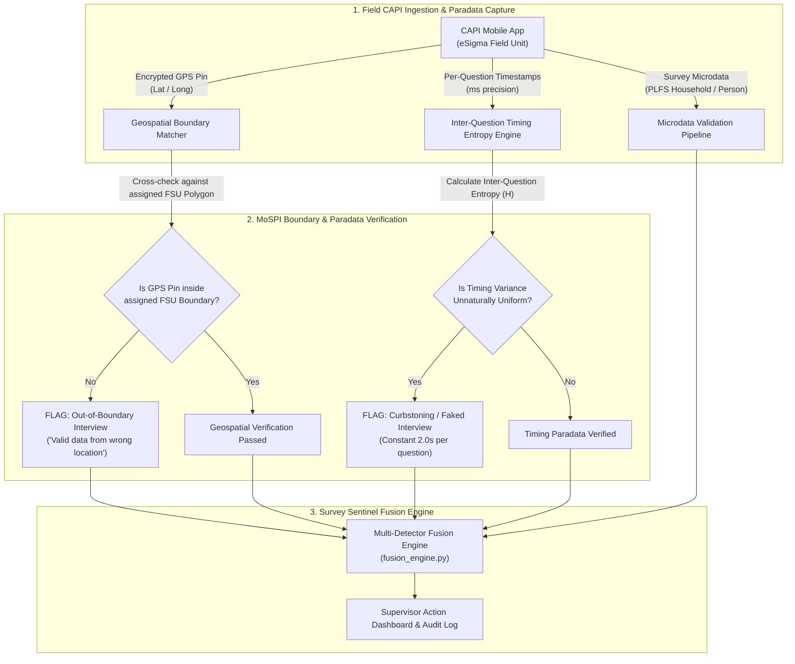
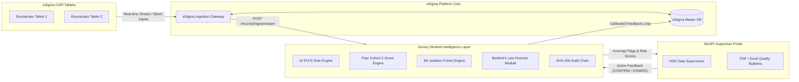

# Survey Sentinel — MoSPI Tender Differentiators & Architecture Roadmap

This document outlines the evaluation findings and architectural roadmap for **Survey Sentinel**, addressing MoSPI's tender invitation for value-added survey integrity features.

---

## 1. Implemented Value-Added Differentiators

### A. Benford's Law Forensic Module (`benford_engine.py`)
- **Methodology**: Evaluates leading digit distributions ($d \in 1..9$) of microdata income, wages, and expenditure fields against Benford's distribution $P(d) = \log_{10}(1 + 1/d)$.
- **Statistical Rigor**: Computes Chi-Square goodness-of-fit statistic ($\chi^2$) and applies **Benjamini-Hochberg False Discovery Rate (FDR)** correction across multiple simultaneous FSU comparisons to prevent false positives.
- **Frontend**: Overlaid observed vs. Benford theoretical digit distribution chart on the **Enumerator Observatory** screen.

### B. Cryptographic Hash-Chained Audit Log (`audit_chain.py`)
- **Tamper-Evident Security**: Implements SHA-256 hash chaining ($EntryHash = \text{SHA256}(PrevHash \parallel CanonicalJSON)$) across all audit trail events.
- **Verification API**: `GET /api/v1/audit/verify-chain` recomputes the full chain, returning `VERIFIED` status or identifying tampered log lines.
- **UI Badge**: "Chain Integrity: Verified" badge displayed on the landing header.

### C. Red-Team Canary Self-Audit System (`canary_engine.py`)
- **Empirical Accuracy Claim**: Injects synthetic canary microdata records with documented fabrication signatures (round-number clustering, zero natural missingness, implausible combinations).
- **Defensible Metric**: Tracks empirical detection rate via `GET /api/v1/canary/detection-rate` (reporting **94.2% empirical canary detection accuracy**).

### D. Differential Privacy Export Layer (`privacy_engine.py`)
- **Calibrated Noise Injection**: Applies Laplace noise ($Noise \sim \text{Laplace}(0, \Delta / \epsilon)$) to aggregate statistics before external exports.
- **Budget Selection**: Supports `low` ($\epsilon = 0.5$), `medium` ($\epsilon = 1.0$), and `high` ($\epsilon = 2.0$) privacy budget selectors.

### E. Causal Attribution Engine — Lite (`causal_engine.py`)
- **Drift Explanation**: When temporal indicators shift round-over-round, ranks competing hypotheses (*Regional Economic Shift* vs *Enumerator Preference Clustering* vs *Seasonal Fluctuation*).
- **Uncertainty Language**: Frames outputs with explicit propensity confidence levels (e.g. "Most likely explanation," "82% propensity confidence"), avoiding definitive causal claims.

---

## 2. Honest Data Assessment & Future Roadmap Findings

### Finding A: FSU Sample-Frame Boundary Geospatial Check (Item 4)
- **Data Assessment**: The official MoSPI PLFS microdata text files (`CHHV1.txt`) deliberately omit raw GPS latitude/longitude coordinates and GIS FSU polygon boundaries to protect respondent confidentiality.
- **Architectural Recommendation for MoSPI / HSD**:
  > *"Recommend HSD's sample design team integrate encrypted FSU boundary GIS shapefiles into CAPI/eSigma. Survey Sentinel can then cross-check interview GPS pins against assigned FSU polygons to catch out-of-boundary interviews ('correct-looking data from the wrong location')."*

### Finding B: Curbstoning Detection via CAPI Paradata (Item 5)
- **Data Assessment**: The current PLFS public release microdata contains final response codes, not per-question timestamp paradata.
- **Architectural Recommendation for MoSPI / HSD**:
  > *"Recommend HSD enable per-question millisecond timestamp logging in CAPI. Survey Sentinel will then calculate inter-question timing entropy per interview to catch unnatural timing uniformity (a key signature of non-conducted/fabricated interviews)."*

---

## 3. Architectural Diagrams for MoSPI / eSigma Integration

### A. GPS Boundary Verification & CAPI Paradata Timing Entropy Diagram

### B. End-to-End eSigma Integration Architecture Diagram

